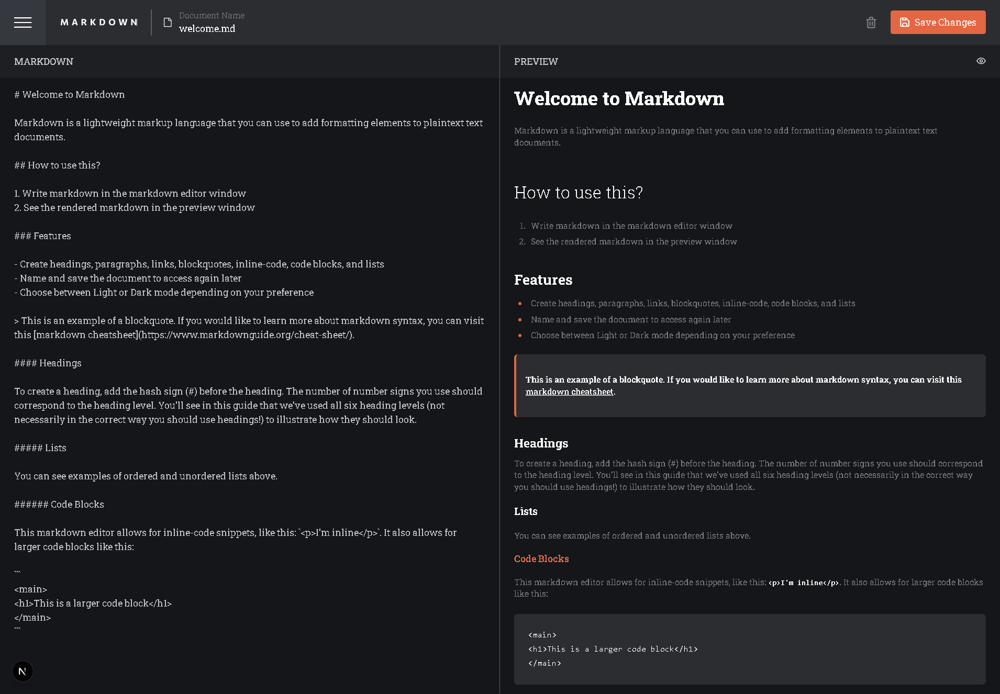

# Frontend Mentor - In-browser Markdown Editor Solution

This is my solution to the [In-browser Markdown Editor challenge on Frontend Mentor](https://www.frontendmentor.io/challenges/inbrowser-markdown-editor-r16TrrQX9). The goal of this challenge was to create a feature-rich markdown editor with real-time preview and local persistence.

## Table of Contents

- [Frontend Mentor - In-browser Markdown Editor Solution](#frontend-mentor---in-browser-markdown-editor-solution)
  - [Table of Contents](#table-of-contents)
  - [Overview](#overview)
    - [The Challenge](#the-challenge)
    - [Screenshot](#screenshot)
  - [Links](#links)
  - [My Process](#my-process)
    - [Built With](#built-with)
    - [What I Learned](#what-i-learned)
    - [Continued Development](#continued-development)
    - [Useful Resources](#useful-resources)
  - [Author](#author)

## Overview

### The Challenge

Users should be able to:

- Create, read, update, and delete markdown documents
- Name and save documents to be accessed later
- Edit markdown and see the formatted preview instantly
- View a full-page preview of formatted markdown
- Enjoy responsive layouts optimized for all screen sizes
- Experience smooth hover states on interactive elements
- **Bonus**: Store markdown data in `localStorage` to persist across refreshes
- **Bonus**: Optionally build as a full-stack app (not covered here)

### Screenshot



## Links

- **Solution URL**: [View solution on Frontend Mentor](https://www.frontendmentor.io/solutions/in-browser-markdown-editor-nextjs-pkhf0iEOaE)
- **Live Site URL**: [View live site](https://in-browser-markdown-editor-tau.vercel.app/)

## My Process

### Built With

- Semantic HTML5
- Tailwind CSS
- Flexbox
- React
- Next.js
- `localStorage` for persistence
- Markdown rendering via [`react-markdown`](https://github.com/remarkjs/react-markdown)

### What I Learned

One of the most useful things I learned during this challenge was how to synchronize `contentEditable` fields with React state for a seamless editing experience, and how to safely render markdown with `react-markdown`. I also got to fine-tune my knowledge of `localStorage` and conditional theming.

Example: Setting default dark mode state properly from `localStorage` while defaulting to `true` if not set.

```js
const [isDarkMode, setIsDarkMode] = useState(() => {
  const stored = localStorage.getItem('darkMode');
  return stored !== null ? stored === 'true' : true;
});
```

### Continued Development

In future updates, I’d like to:

- Add document versioning or autosave
- Sync markdown files with cloud storage (e.g. Firebase)
- Improve accessibility and keyboard navigation
- Add export options (PDF, .md download)

### Useful Resources

- [Markdown Guide](https://www.markdownguide.org/) - Always a great resource when working with markdown.
- [React Markdown Docs](https://github.com/remarkjs/react-markdown) - Helped a lot with customizing the markdown rendering.
- [TailwindCSS Documentation](https://tailwindcss.com/docs) - My go-to for quick layout and styling help.

## Author

- Website – [iwaola.me](https://iwaola.me)
- Frontend Mentor – [@fawaziwalewa](https://www.frontendmentor.io/profile/fawaziwalewa)
- Twitter – [@IwalewaFawaz](https://twitter.com/IwalewaFawaz)
